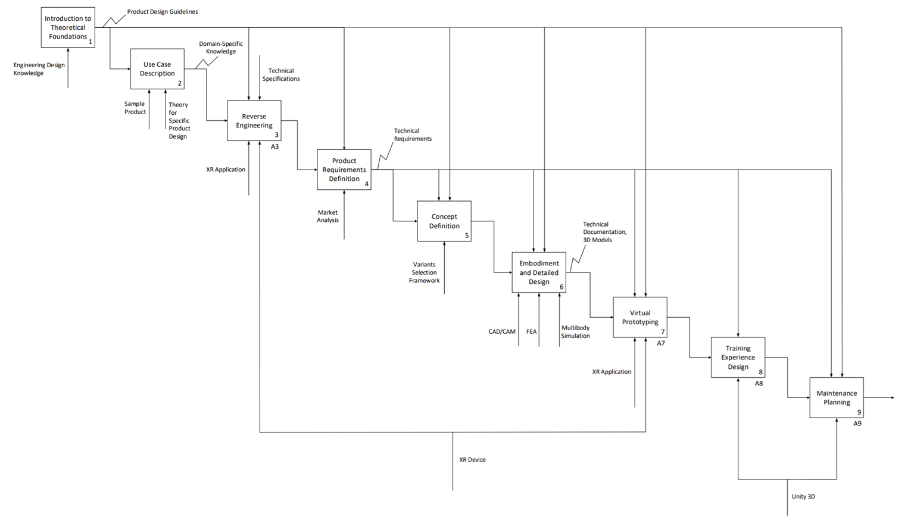
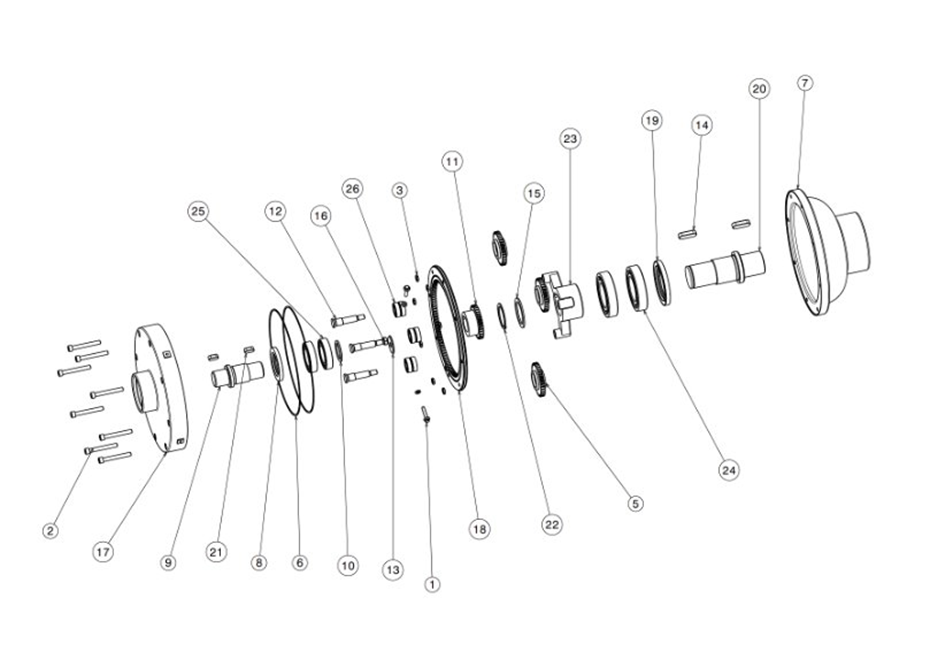
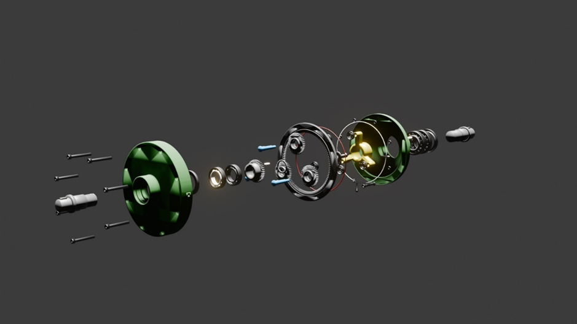
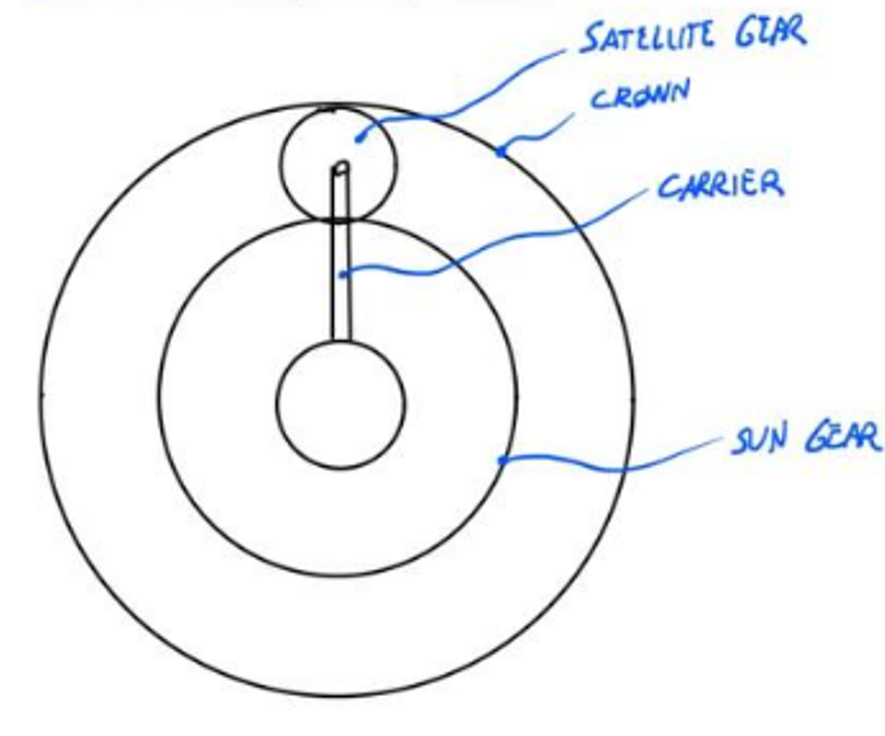
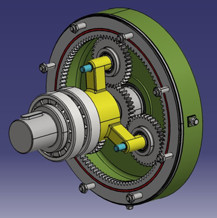
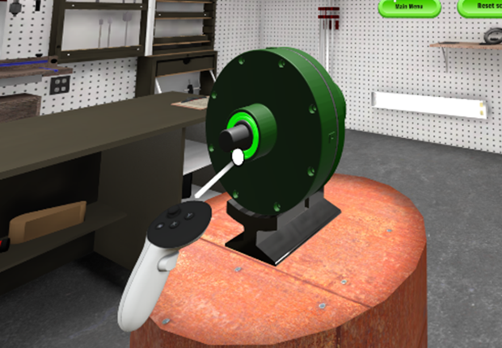

# XR Learning Workflow - Mechanical Product Design

## Introduction

### Learning Objectives
* Experiencing **Product Design process** in an interactive way
* **Analyze and test** complex mechanical components using XR technologies

### Use Case
This comprehensive workflow guides engineering students through the product development process, utilizing a **Planetary Gearbox** as a real-world case study. By examining this complex mechanical system, students gain hands-on experience with essential product design principles and methodologies, from initial concept to final implementation. The **Planetary Gearbox**'s sophisticated mechanism and wide industrial applications make it an ideal teaching tool for demonstrating the practical challenges and considerations in mechanical engineering design. 3D models and data related to the Gearbox are provided in the [XREN GitHub Repository](https://github.com/xrlearning).

## Mechanical Product Design - General Learning Workflow

| Activity | Overview |
|---|---|
|1 - Introduction to Theoretical Foundations
 | • **Description**: This initial phase of the workflow introduces students to fundamental Engineering Design concepts, providing them with the essential theoretical foundation needed to navigate the entire design process effectively. Additionally, students receive a comprehensive overview of the upcoming activities within the learning experience, ensuring they grasp both the purpose and significance of each step they will undertake. This structured introduction establishes a clear framework for understanding how individual tasks contribute to the broader engineering design methodology.   • **Output**: Product Design Guidelines   • **Resource**: Engineering Design Knowledge | 
| 2 - Use Case Description |  

   • **Description**: This critical step aims to equip students with comprehensive domain-specific knowledge essential for designing a complex mechanical system. The learning module provides a thorough exploration of the technology's fundamental principles, operational mechanics, and technical specifications. By establishing a robust understanding of these core concepts, students develop a reliable reference framework that supports their practical experimentation with XR technologies. This detailed foundation ensures students can effectively bridge theoretical knowledge with hands-on applications.   • **Output**: Domain-specific Knowledge   • **Input**: Product Design Guidelines   • **Resources**: A sample product, which will be used as Use Case, and theoretical aspects about the design of the specified product| 
| 3 - Reverse Engineering | 

   • **Description**: Students are immersed in an interactive virtual environment where they can explore and manipulate a 3D model of a reference product similar to their design objective. Through hands-on experimentation with this digital prototype, students discover key features and operational principles, gaining valuable insights that inform their own design conceptualization. This experiential learning approach enables students to develop a deeper understanding of product functionality while beginning to envision their unique solutions and critical design characteristics.   • **Output**: Product's Features List   • **Input**: Domain-specific Knowledge   • **Controls**: Product Design guidelines and technical specifications of the sample product   • **Resources**: XR application, XR device     [A3 - Reverse Engineering - Specific Workflow](ReverseEngineeringWF.md)| 
| 4 - Product Requirements Definition | • **Description**: In this phase, students embark on the task clarification stage of product development, systematically identifying and analyzing the core objectives and constraints associated with the reference product. Through the development of a comprehensive requirements list, students establish critical technical specifications that will serve as essential benchmarks throughout the subsequent mechanical design phases and XR learning workflow. This foundational documentation ensures all design decisions remain aligned with project goals while providing clear evaluation criteria for validating design outcomes.   • **Output**: Technical Requirements List   • **Input**: Product's Features List   • **Controls**: Product Design guidelines   • **Resource**: Market Analysis| 
| 5 - Concept Definition | 

   • **Description**: During the Conceptual Design phase, students develop fundamental solution principles that will shape their design approach. This crucial stage begins with a systematic analysis of the requirements list to identify key design challenges and technical constraints. Students then define the system's core functionalities and propose innovative technical solutions to achieve these objectives. Through detailed sketches, drawings, and preliminary assembly concepts, students articulate their understanding of the system's working principles and demonstrate how their proposed solutions address the identified challenges. This phase establishes the foundational framework that will guide subsequent detailed design decisions.   • **Output**: Concept   • **Input**: Technical Requirements   • **Control**: Product Design Guidelines, Technical Requirements   • **Resource**: Variants Selection Framework| 
| 6 - Embodiment and Detailed Design | 

   • **Description**: In the Embodiment and Detailed Design phase, students transform their conceptual framework into a comprehensive technical solution. Starting from their initial concept, they develop the complete product layout while rigorously evaluating design choices against both technical feasibility and economic viability criteria. Using advanced design software, students define precise specifications including component geometries, dimensional requirements, material selections, and surface characteristics for each system element. This phase also encompasses manufacturing strategy development and cost analysis, ensuring producibility and economic efficiency. The process culminates in the creation of detailed technical documentation that captures all essential design specifications, manufacturing requirements, and assembly instructions.   • **Output**: Technical Documentation, 3D models of the product   • **Input**: Concept   • **Controls**: Product Design guidelines, Technical Requirements   • **Resources**: CAD/CAM software, Finite Element Analyses (FEA), Multibody Simulations | 
| 7 - Virtual Prototyping | 

   • **Description**: In this phase students leverage XR technologies to create an immersive testing environment for their mechanical system design. This interactive virtual platform enables students to engage with their product in multiple ways: manipulating components, performing assembly operations, and evaluating functionality across various use scenarios. Through this hands-on virtual experimentation, students gather critical insights about their design decisions and system performance. The immersive testing environment serves as a valuable validation tool, helping identify potential improvements and determining whether design iterations are necessary to achieve optimal performance. This iterative feedback loop ensures refined design solutions before physical prototyping begins.   • **Output**: Virtual prototype validation report, functionality test outcomes, design improvement recommendations (if any)   • **Input**: Technical Documentation, 3D models of the product   • **Controls**: Product Design guidelines, Technical Requirements   • **Resources**: XR application, XR device     [A3 - Virtual Prototyping - Specific Workflow](VirtualPrototypingWF.md) | 
| 8 - Training Experience Design | • **Description**: In the Training Experience Design phase, students develop an XR-based training application that translates their technical knowledge into an intuitive learning experience for end-users. This interactive platform serves multiple purposes: demonstrating proper product operation, illustrating its working principle, highlighting safety protocols, and visualizing troubleshooting scenarios. Through immersive simulations, users can practice assembly/disassembly sequences, understand component interactions, and master operational procedures in a risk-free virtual environment. This approach not only replaces traditional text-heavy manuals but also accelerates skill acquisition through hands-on learning, reducing training time and potential user errors while improving knowledge retention.   • **Output**: Step-by-step interactive tutorials, safety warnings and emergency procedures   • **Input**: Virtual prototype validation report, functionality test outcomes   • **Control**: Technical Requirements   • **Resource**: 3D Development Engine (Unity 3D)| 
| 9 - Maintenance Planning | • **Description**: In the Maintenance Planning phase, students develop a comprehensive maintenance strategy that leverages XR technologies to optimize product support and service operations. This phase integrates remote collaboration capabilities and assisted maintenance solutions to ensure efficient product upkeep throughout its lifecycle. Through XR-enabled platforms, maintenance technicians can receive real-time expert guidance, access interactive repair procedures, and visualize complex maintenance sequences.   • **Output**: XR-based maintenance support application   • **Input**: Step-by-step interactive tutorials, safety warnings and emergency procedures.   • **Controls**: Product Design guidelines, Technical Requirements   • **Resource**: 3D Development Engine (Unity 3D)| 