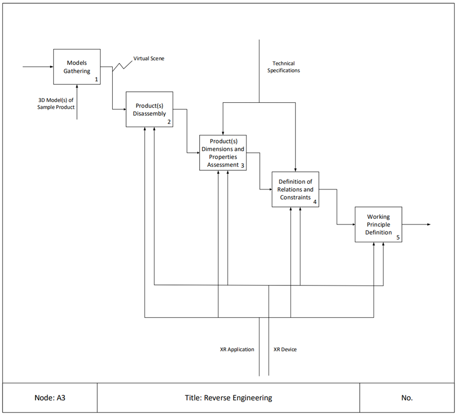
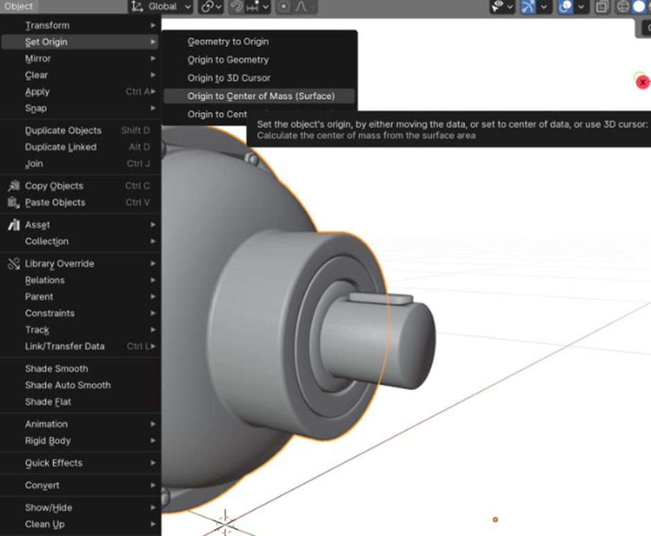
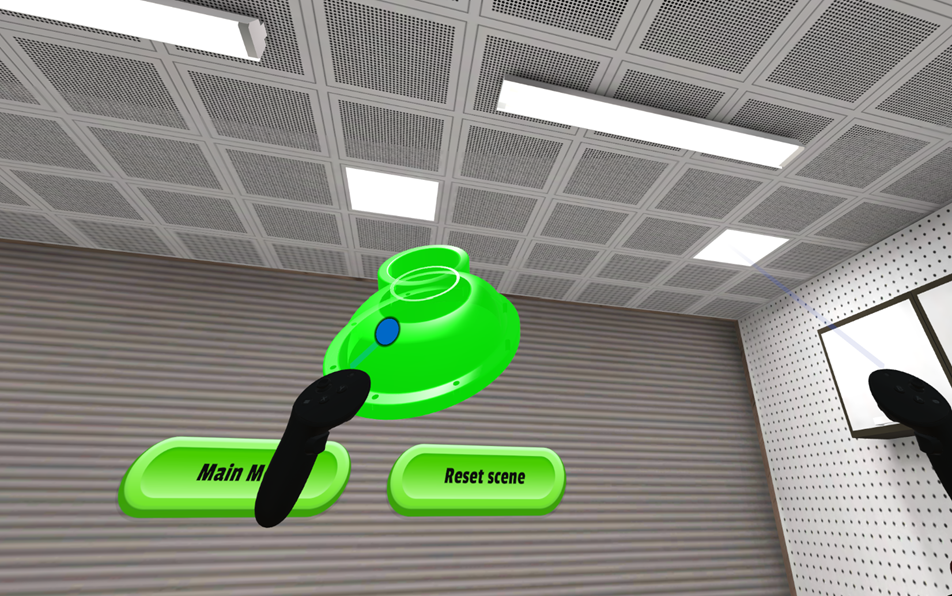

## Reverse Engineering - Specific Learning Workflow

| Activity | Overview |
|---|---|
|1 - Models Gathering 
 | 

   • **Description**: High-fidelity 3D models of reference products are integrated into an interactive virtual environment, creating an immersive learning platform. This carefully crafted virtual scene guides students through a systematic exploration of analogous mechanical systems, enabling them to discover and analyze fundamental working principles. Through strategic decomposition of complex assemblies, interactive animations, and dynamic simulations, students gain hands-on experience with key mechanical concepts, component relationships, and operational sequences.   • **Output**: Virtual Scene   • **Input**: Domain-specific Knowledge   • **Resource**: 3D Model(s) of Sample Product | 
|2 - Product(s) Disassembly 
 | 

   • **Description**: Within the interactive virtual environment, students engage in systematic disassembly procedures to decode the reference product's design architecture. Through this hands-on virtual exploration, students identify and analyze critical functional components and document assembly sequences. This detailed investigation helps students grasp both the hierarchical structure of the assembly and the precise role of each component within the system.   • **Output**: Design intent understanding   • **Input**:  Virtual Scene   • **Resources**: XR application, XR device| 
|3 - Product(s) Dimensions and Properties Assessment 
 | • **Description**: In this phase, students utilize advanced digital measurement tools to perform detailed dimensional analysis of critical components. Through precise virtual inspection tools, students capture key geometric parameters, tolerances, and spatial relationships between interacting parts.   • **Output**: Critical dimension identification   • **Input**: Design intent understanding   • **Control**: Technical Specifications   • **Resources**: XR application, XR device| 
|4 - Definition of Relations and Constraints 
 | • **Description**: During this phase, the software environment enables students to investigate constraint mechanisms, kinematic relationships, and mechanical interfaces, providing insights into the design rationale behind each component's specifications. This detailed examination helps students understand how assembly constraints influence overall system performance.   • **Output**: Mechanical relationship modeling   • **Input**: Critical dimension identification   • **Control**: Technical Specifications   • **Resources**: XR application, XR device| 
|5 - Working Principle Definition 
 | • **Description**: This culminating phase of the Reverse Engineering workflow synthesizes students' analytical findings into a comprehensive understanding of the product's operational principles. Through their virtual disassembly experience and component analysis, students formulate detailed descriptions of system functionality, energy flows, and mechanical relationships. This synthesized knowledge forms the foundation for their own design process, enabling them to extract key engineering principles, identify design opportunities, and develop innovative solutions in the subsequent Conceptual Design phase. Students translate their observations and insights into formal documentation that bridges reverse engineering analysis with forward-looking design activities.   • **Output**: Product's Feature List   • **Input**: Mechanical relationship modeling   • **Resources**: XR application, XR device | 