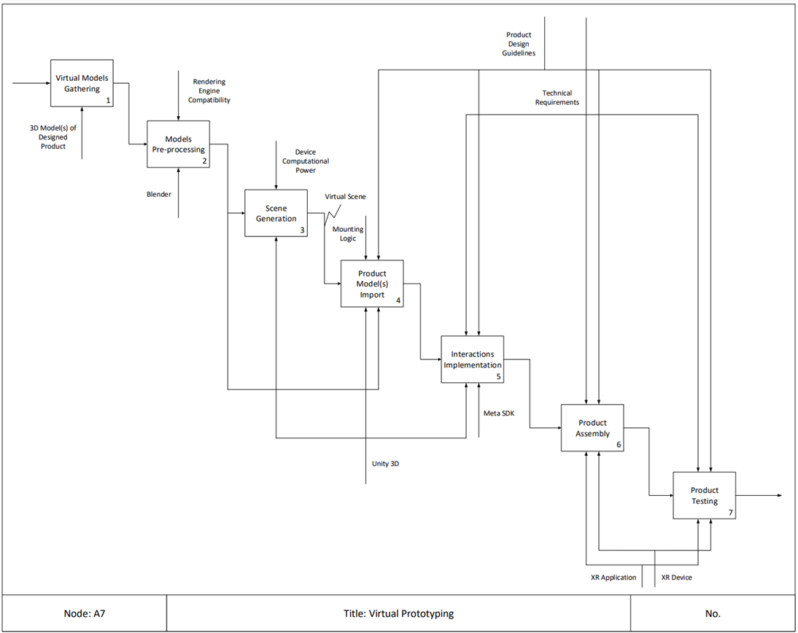

## Virtual Prototyping - Specific Learning Workflow

| Activity | Overview |
|---|---|
|1 - Virtual Models Gathering 
 | • **Description**:    • **Output**:   • **Input**:   • **Resource**: | 
|2 - Models Pre-processing 
 | • **Description**:    • **Output**:   • **Input**:   • **Control**:   • **Resource**: | 
|3 - Scene Generation 
 | • **Description**:    • **Output**:   • **Input**:   • **Control**:   • **Resource**: | 
|4 - Product Model(s) Import 
 | • **Description**:    • **Output**:   • **Input**:   • **Control**:   • **Resource**: | 
|5 - Interactions Implementation 
 | • **Description**:    • **Output**:   • **Input**:   • **Control**:   • **Resource**: | 
|6 - Product Assembly 
 | • **Description**:    • **Output**:   • **Input**:   • **Control**:   • **Resource**: | 
|7 - Product Testing 
 | • **Description**:    • **Output**:   • **Input**:   • **Control**:   • **Resource**: | 